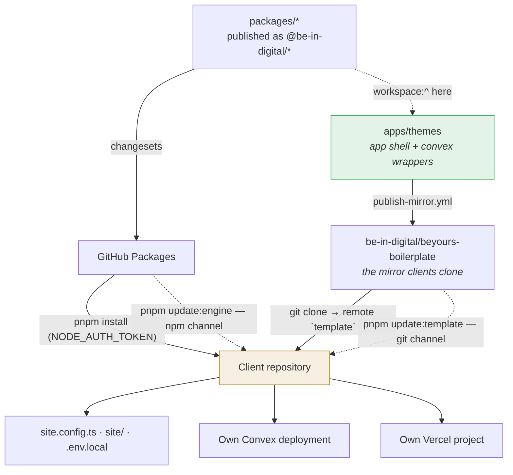

<!-- Generated automatically — do not edit here. -->

> ⚠️ **Generated repository.** Its contents are produced from `apps/themes` in
> the [beyours](https://github.com/be-in-digital/beyours)
> monorepo and replaced in full on every sync. **A commit made directly here
> will be lost** — changes belong in the monorepo.
>
> This repository exists because a client site cannot clone a subdirectory of a
> monorepo: it is the shippable cut, with the engine packages at published
> versions and a lockfile of its own.

# `apps/themes` — the client site template

The site every restaurant receives. It carries the complete application shell —
e-commerce storefront, admin dashboard, CMS, QR games, kitchen display — and
consumes the business logic from the `@be-in-digital/*` packages.

Each client is a **git clone** of it, with their own repository, their own Convex
backend and their own Vercel project.

> Counts below were measured on **2026-09-10, at commit `f6c33c3`**.



> **Why "themes".** This directory carries the catalogue: `templates/`, 51 art
> directions, one per theme sold. That is what the restaurant owner picks and
> pays for. The application around it is the rendering engine that brings the
> chosen theme to life — a client applies exactly one, tuned to their brand.

> ⚠️ **Clients do not clone this directory, they clone the mirror repository**
> `be-in-digital/beyours-boilerplate`. Here the engine dependencies are
> `workspace:^`; over there they are published versions, with their own
> lockfile. The crossing is automated — see
> [`scripts/publish-mirror.mjs`](../../scripts/publish-mirror.mjs).

---

## In one minute

| | |
| --- | --- |
| **What it is** | The deliverable — 109 page routes, 9 route handlers, 51 design templates, 50 sales demos |
| **Who uses it** | One restaurant owner per clone, plus the team that creates the sites |
| **What comes from the engine** | 9 `@be-in-digital/*` packages — logic, Convex schema, UI, admin |
| **What is specific to the template** | The client zone, the templates, the creation and update scripts, the demos |
| **Data isolation** | 1 Convex deployment per client — structural, not a filter someone remembers |
| **Tests** | 146 Vitest files · 57 Playwright specs |

⚠️ **This app carries deliberate dead code.** "Nothing imports it" does not prove
"removable" here — the client zone exists to be extended by a client. Read
[`tasks/reference-themes-divergence.md`](../../tasks/reference-themes-divergence.md)
before deleting anything.

---

## The demos: the sales tool

`demos/` holds **50 browsable static storefronts** — 5 verticals × 10 themes —
each with a menu, a cart and Stripe payments in test mode. A prospect tries the
site before buying it, with nothing provisioned.

```bash
# offline, no dependencies, no server
open demos/index.html
```


Plain HTML/CSS/JS: no build, no server, no backend. Each demo covers both faces
of the product — the storefront the end customer sees, and the back office the
owner sees.


Two guarantees worth stating, because both were once false:

- **Every link works** — navigation, footer, `tel:`, `mailto:`, Maps directions,
  validated forms. Zero `href="#"`, swept in a browser.
- **The reservation page links out, it does not book.** The product has no
  reservation feature: `stores.reservationUrl` points at the establishment's own
  tool (TheFork, Zenchef, Guestonline) and the button renders only when one is
  set. `reserve.html` says so and offers the phone. It used to render a full
  booking form with always-free slots and a reference number written to the
  visitor's `localStorage` — a feature the buyer would never have received.

---

## Stack

- **Next.js 16** (App Router, Turbopack), **React 19**, **Tailwind CSS v4**
- **Convex** — one deployment per client; schema and functions from
  `@be-in-digital/convex-schema` and `convex-functions`
- **Better Auth** — web cookies, admin/customer roles, guest checkout
- **Payments** — Stripe, PayPal, SumUp, cash · **Platforms** — Uber Eats, Deliveroo
- **AWS** — S3 (media), SES (email) · **OpenAI** — translations
- **Tests** — Vitest + Playwright

---

## Creating a new client site

Two configurations: **web** (storefront + admin) or **web + app** (plus an Expo
mobile customer app).

### The `beyours` CLI (recommended)

Install once, with `gh` authenticated:

```bash
gh api repos/be-in-digital/beyours-boilerplate/contents/scripts/beyours \
  -H "Accept: application/vnd.github.raw" > /opt/homebrew/bin/beyours \
  && chmod +x /opt/homebrew/bin/beyours
beyours token ghp_xxx           # read:packages PAT, stored chmod 600
```

> The CLI was called `beindigital` before August 2026. An existing installation
> keeps working; reinstall under the new name and delete the old binary.

Then everything happens in the terminal:

```bash
beyours create client-luigi --name "Chez Luigi" --repo be-in-digital/client-luigi
beyours create client-luigi --name "Chez Luigi" --mobile              # web + app
beyours create client-luigi --name "Chez Luigi" --template pizzeria   # vertical design
beyours help · version · upgrade
```

The CLI fetches its scripts from the mirror on every call, so it picks up
template updates without reinstalling. Equivalent without the CLI:

```bash
gh api repos/be-in-digital/beyours-boilerplate/contents/scripts/create-site.mjs \
  -H "Accept: application/vnd.github.raw" | node --input-type=module - \
  client-luigi --name "Chez Luigi" --repo be-in-digital/client-luigi
```

The command chains: clone the template → `template` remote (for updates) →
create the private GitHub repository → `pnpm install` → full configuration
(`site.config.ts`, generated secrets, `.env.local`, mobile app if requested) →
initial commit → push. From an existing clone: `pnpm create:site <dir> [options]`.

### By hand (equivalent)

```bash
git clone https://github.com/be-in-digital/beyours-boilerplate.git client-luigi
cd client-luigi && git remote rename origin template
export NODE_AUTH_TOKEN=ghp_xxx
pnpm install
pnpm setup            # wizard: name, description, locale, web / web + app, design template
```

Then provision the backend and the environment:

```bash
pnpx convex dev      # creates the deployment, fills .env.local
pnpm env:setup       # wizard: required values + integrations (Stripe, AWS, Uber…)
pnpm convex:env      # pushes .env.convex to Convex
pnpm dev
```

`pnpm setup` is **idempotent**: `.beindigital-site.json` marks a site as already
initialised. Re-run with `--force`.

> GitHub's "Use this template" button also works, but breaks the shared history:
> the first `pnpm update:template` will need `-- --first`. Cloning is the
> recommended path.

⚠️ `pnpm preinstall` runs `check-node-auth-token.mjs`. Without a
`read:packages` PAT in `NODE_AUTH_TOKEN`, `pnpm install` would fail with an
opaque `401 Unauthorized`; the guard catches it early and prints what to do.

---

## Environment — three files, one source of truth

```
.env.local     Next.js web     ← the source of truth
.env.convex    Convex backend  ← shared subset, pushed by `pnpm convex:env`
mobile/.env    Expo app        ← EXPO_PUBLIC_CONVEX_URL
```

`.env.convex` holds **per-client** values — the restaurant's own AWS keys, its
Stripe account, its Deliveroo brand and site ids. One file per client repository,
gitignored, shared with nobody.

| Command | Role |
| --- | --- |
| `pnpm env:setup` | Wizard: auto-generated secrets, required values, then integration-by-integration activation (Stripe, AWS, PayPal, SumUp, OpenAI, Uber Eats, Deliveroo, Maps, Sentry, Unsplash) |
| `pnpm env:check` | Status: missing required values, incomplete integrations, out-of-sync files. Non-zero exit on problems |
| `pnpm env:sync` | Propagates `.env.local` → `.env.convex` (shared keys) and → `mobile/.env` |
| `pnpm convex:env` | Applies `.env.convex` through `convex env set`. `--prod` targets production |
| `pnpm convex:env:infisical` | Same, reading the Infisical store as the source of truth |

`env:setup` also works piped (answers on stdin) for automation.

⚠️ **`--infisical` treats the store as authoritative and overwrites what was
changed elsewhere.** A value rotated on a deployment but not in the store is
undone at the next provisioning — silently, with a green summary. Rotate in the
store first.

Monitoring is per client: each site reports to **its own Sentry project**, and
reports nothing until its DSN is set — [`docs/SENTRY.md`](docs/SENTRY.md).

A web-only site can enable the mobile app later with `pnpm add:mobile`, which
copies `.template/mobile/` → `mobile/`, writes `app.json`, `mobile/.env` and
`eas.json`, and refuses to overwrite an existing `mobile/`.

---

## Customising the site

All customisation lives in the **client zone** — never in engine code:

| What | Where |
| --- | --- |
| Name, SEO, locale, image hosts | `site.config.ts` |
| Colours / design tokens | `site/theme.css` |
| Fonts | `site/fonts.ts` |
| Custom components | `site/components/` |
| Logos, favicon, images | `public/` |
| Content, opening hours, menus, copy | Admin dashboard (CMS + settings, stored in Convex) |

Details and limits: [`docs/CUSTOMIZATION.md`](docs/CUSTOMIZATION.md).

Logo, favicon and brand name are per store, through the CMS `branding` block on
the `storefront-layout` page — the only branding the storefront header, the
favicon, the JSON-LD and the admin sidebar actually read.

Colours and typography are per store too, since #353, and actually reached a
diner only from #410 — see [`packages/ui`](../../packages/ui/README.md) for what
the scoping fix was and why it was needed.

### Design templates

51 templates across 5 verticals. A template lays down the full identity
(light/dark colours, fonts, shapes) in the client zone; colours are then tuned to
the client's brand in `site/theme.css`.

| Slug | Direction |
| --- | --- |
| `pizzeria` | Trattoria: wood-oven terracotta, Italian didone |
| `fast-food` | Smash: mustard on charcoal, fleshy grotesque |
| `food-truck` | Convoy: enamelled petrol on kraft, condensed stencil |
| `poulet` | Embers: chilli red on cream, poster condensed |
| `asiatique` | Izakaya: jade and ink on washi, Japanese gothic |

```bash
pnpm template:list             # catalogue
pnpm template:apply poulet     # applies it (or --template at creation time)
pnpm template:apply default    # restores the original theme
```

**Each template is four files, not two:** `theme.css`, `fonts.ts`,
`template.json` and `DESIGN.md`. `template.json` is **load-bearing, not
documentation** — the applier reads it, so a template written from a "two files"
description will not apply.

Visual preview: open `templates/preview.html`. Art direction per template:
[`templates/README.md`](templates/README.md) and `templates/<slug>/DESIGN.md`.

⚠️ **`pnpm template:apply` repaints the admin and the sign-in pages, not the
storefront.** All 51 `site/theme.css` files target `:root` and `.dark`, while the
storefront palette is declared on `.storefront-theme`. Recorded in
`tasks/wcag-contrast-audit-2026-09-08.md`; not fixed.

---

## Updating a site

Two complementary channels ([`docs/UPDATES.md`](docs/UPDATES.md)):

```bash
pnpm update:engine     # business logic: bump @be-in-digital/* (npm, semver)
pnpm update:template   # app shell: git merge from the `template` remote
```

| Flag | Effect |
| --- | --- |
| `update:engine -- --check` | Lists versions, changes nothing |
| `update:engine -- --latest` | Crosses major versions — **breaking** |
| `update:template -- --dry-run` | Lists the commits without merging |
| `update:template -- --first` | First sync of a repo created with "Use this template" |

Each update chains codegen + typecheck + tests and points at the engine
changelogs.

⚠️ **`update:template` does not check the maintenance contract.** The business
model says an expired site stays frozen on the last covered release
(`packages/convex-functions/src/maintenance.ts`). In practice
`scripts/update-template.mjs` runs a bare `git fetch template`: an expired site
that runs the command receives everything. The guard is still to be written.

---

## Developing against a local engine (no registry)

```bash
git clone https://github.com/be-in-digital/beyours ../beyours
pnpm engine:link       # pnpm symlinks pointing at the clone
# … develop …
pnpm engine:unlink     # back to the registry — never commit in link mode
```

This is also how you validate the boilerplate with no `NODE_AUTH_TOKEN` at all.

`scripts/engine-versions.mjs` answers the question a failure cannot: **which
`@be-in-digital/*` versions this run actually installed.** The declared range is
already in `package.json`; what it resolved to is not, and the app shell (synced
from the engine at HEAD) and the packages (from the registry at whatever was last
published) can be days apart.

---

## Command reference

| Command | Role |
| --- | --- |
| `pnpm create:site <dir>` | Creates a complete site (clone + repo + config) |
| `pnpm setup` | Initialises a client site (idempotent, web / web + app) |
| `pnpm add:mobile` | Enables the Expo mobile app on a web site |
| `pnpm dev` · `build` · `start` | Next.js |
| `pnpm lint` · `typecheck` · `type-check` | Quality. `typecheck` runs `tsc` twice — the app, then `convex/tsconfig.json` |
| `pnpm test` · `test:watch` · `test:coverage` · `test:ui` | Vitest |
| `pnpm test:e2e` · `test:e2e:ui` · `test:e2e:debug` | Playwright |
| `pnpm test:e2e:install` | `playwright install --with-deps chromium` |
| `pnpm convex:dev` · `convex:deploy` · `convex:codegen` | Convex backend |
| `pnpm convex:env` · `convex:env:infisical` | Push `.env.convex` to the deployment |
| `pnpm env:setup` · `env:check` · `env:sync` | The three env files |
| `pnpm template:list` · `template:apply <slug>` | Design templates |
| `pnpm update:engine` · `update:template` | The two update channels |
| `pnpm engine:link` · `engine:unlink` | Local development against the engine |
| `pnpm ses:check` | Is this deployment out of the SES sandbox yet? |
| `pnpm clean` | Remove `.next` and `node_modules` |

⚠️ **`pnpm ses:check` answers a question that cannot be answered on go-live
day.** A new AWS account starts in the SES *sandbox*: mail reaches only addresses
you verified yourself, capped at 200 a day. A restaurant that opens in the
sandbox takes orders and confirms none of them, and nothing errors visibly — SES
simply refuses the send. Leaving the sandbox is a request AWS reviews by hand.

Two provisioning scripts are runbooks with a human in them, not tasks:

| Script | Does |
| --- | --- |
| `scripts/setup-aws.sh` | Private S3 bucket with PUT-only CORS and lifecycle rules, SES domain identity with DKIM, SES sending config, and the SNS topic for bounce and complaint feedback |
| `scripts/kiosk-print.sh` | Chrome with `--kiosk-printing`, so the kitchen display prints with no dialog |

⚠️ `setup-aws.sh` with **no `SITE_SLUG`** provisions into the shared fleet
account. That is deliberate — a legacy site must be able to re-run it — and it
warns before it does.

---

## Deployment

**Web (Vercel)** — import the repository, Next.js framework, repository root.
Environment variables: every `[REQUIS]` entry from `.env.example` plus
`NODE_AUTH_TOKEN` (secret, for the install). Convex production:
`pnpm convex:deploy`, then copy the production `NEXT_PUBLIC_CONVEX_URL` and
`CONVEX_SITE_URL` into Vercel.

**GitHub Actions CI** — the client's own `ci.yml`: lint, typecheck, tests, build
(requires the `GH_PACKAGES_TOKEN` secret), plus Playwright e2e against a Convex
backend the job starts itself — no variables, no `E2E_*` secrets, and a
conditional mobile job. Full secrets runbook:
[`docs/SETUP-CI.md`](docs/SETUP-CI.md).

**The check to require on `main` is `E2E Status`, never the test job itself.**
This suite is deliberately degraded for clients, and a job that does not run
reports `skipped` — which GitHub counts as satisfied.

⚠️ **This directory's `.github/` is not inert.** GitHub only reads the
`.github/` at a repository root, so these workflows do not run here — but they
are part of the cloned payload and they do run in the client's repository. Do not
delete them.

---

## Security

- **PCI SAQ-A** — no card number ever reaches the server. Stripe Elements on the
  client, webhooks server-side only.
- `BETTER_AUTH_SECRET` and `NODE_AUTH_TOKEN` — 90-day rotation.
- `ENCRYPTION_KEY` encrypts OAuth tokens at rest, in Convex.
- CORS — the Convex HTTP actions validate `Origin` against `SITE_URL`.

---

## Architecture and decisions

- [`docs/design/boilerplate-v2.md`](docs/design/boilerplate-v2.md) — the ADR: why
  single-app, why two update channels
- [`docs/DESIGN_SYSTEM.md`](docs/DESIGN_SYSTEM.md) · [`docs/UPDATES.md`](docs/UPDATES.md) · [`docs/CUSTOMIZATION.md`](docs/CUSTOMIZATION.md)
- [`templates/README.md`](templates/README.md) · [`demos/README.md`](demos/README.md) · [`e2e/README.md`](e2e/README.md)

---

## Things to watch

**Three template lists coexist** — 51 directories in `templates/`, 50 demos in
`demos/`, 52 entries in `apps/site/lib/templates-data.ts`. No test reconciles
them.

**A spec written only here does not run on a pull request.** `ci.yml`'s e2e
target is `apps/reference`. This suite runs on pushes to `main`, in the
eight-shard configuration.

**A commit made directly on the mirror is lost.** The mirror is rebuilt in full
on every sync. All changes belong here.

---

## Picking up this app

1. The [root README](../../README.md) for monorepo context, then this one.
2. Open `demos/index.html` — that is the product, browsable with nothing
   installed.
3. [`docs/design/boilerplate-v2.md`](docs/design/boilerplate-v2.md) for why there
   are two update channels, then
   [`docs/CUSTOMIZATION.md`](docs/CUSTOMIZATION.md) for the boundary between the
   client zone and the engine zone — that contract is what lets updates land
   without conflicts.
4. `scripts/create-site.mjs`, then `scripts/init.mjs`: the whole site-creation
   path lives there.
5. `pnpm dev:themes` from the root, with `convex dev` in a second terminal.
